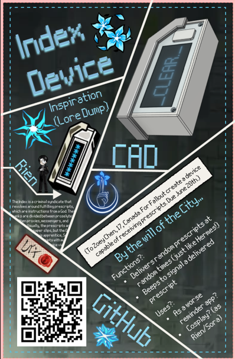
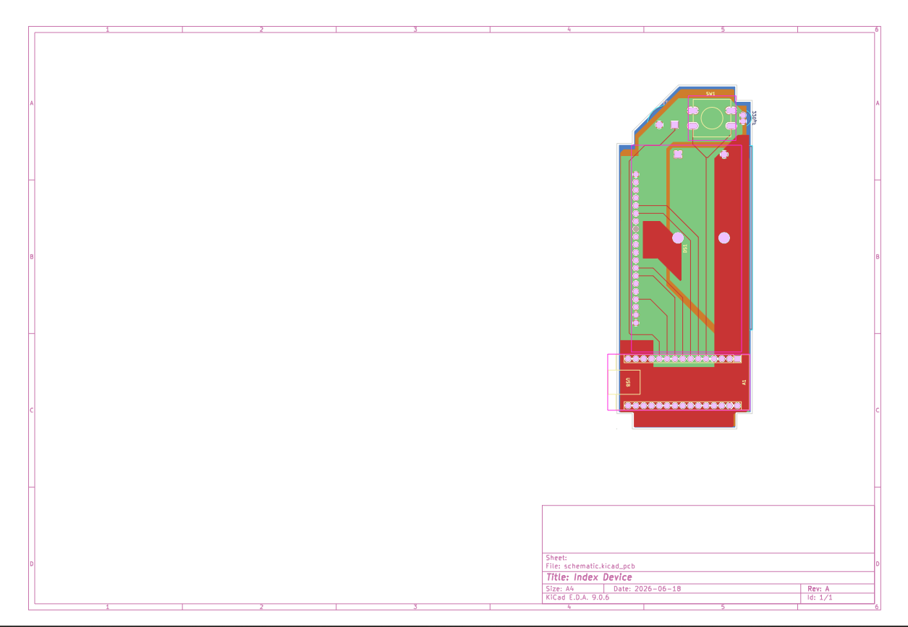
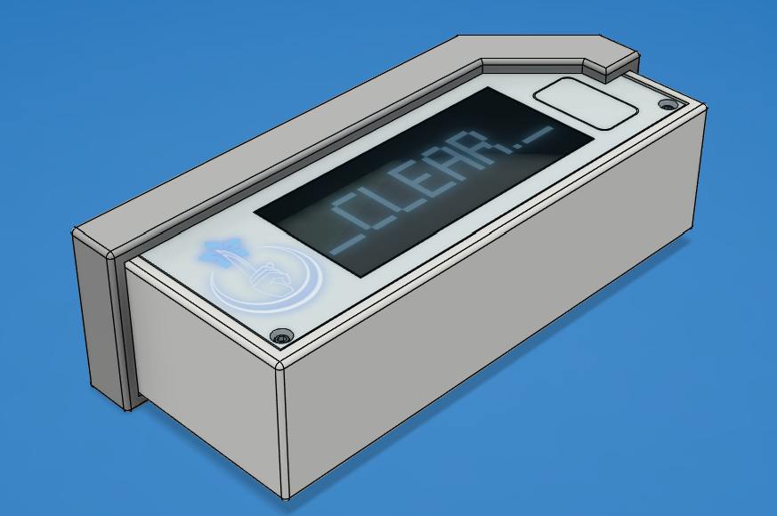

# Index Device

All creative credits go to Project Moon, I'm just trying to create the concept in the real world.

Goal: Create a functional prescript device/beeper, similar to what Rien and Sora have. Funationality being that it makes a beep, displays the prescript, and lets the user say that they've completed it (oh, and also unlock your weapons and grant you shin, mang, and E.G.O.).

Use case: I suppose it can be a worse version of the reminders people set on their phones? I'm mostly doing this because Project Moon has been my latest hyperfixation and I wanted to make something in dedication for it. Another use case to be cosplay Rien, Sora, Index Yi Sang, or Index Don Quixote, but I'm not likely to any of those cosplays anytime soon (mostly, I jsut want to cosplay someone with long hair, which none of these characters have).

***

***

## Zine

(The zine can be found under the zine folder.)

## PCB

(The pdf of the PCB is under CAD models/drawings, while the .kicad_pcb is in the schematic folder)

## Code logic

- Semi-randomly send the messages of cryptic nature while beeping
- A short press of the button tells the device that the prescript has been received and displays the given prescript
- A long press of the button tells the device that the prescript has been cleared, dismissing the current prescript, and showing a clear animation

## CAD

CAD! The CAD (and the project in general) was made to resemble this:

***

***

Trying to be thorough, so I'm just going to word for word answer teh questions in Fallout docs:

✓ Short description of what your project is! Highlight what makes it unique

A beeper that sends cryptic instructions (emphasis on cryptic).

***

✓ How do you use it? Be detailed! Others can’t read your mind.

The device will send the instructions randomly, short press the button to show you've received it, and long press to say you've cleared it.

***

✓ Why did you make it? Be personal! Are you solving a problem? Trying to make something smaller than previously thought possible?

I made this because I'm hyperfixating on Project Moon and I think the Index is a really cool faction! (By the will of the City!)

***

***

 Lore Dump (skippable) 

If you're just here for the project feel free to skip, the rest of the README is just me rambling about Index lore (it's between them and the Ring for which one is my favorite finger).

I need this for myself, but this will contextualize the project better than the intro, or I will sound like a madman, one or the other. So, the Index are one of the five fingers, where the fingers are the five biggest syndicates in the City and between the five of them split up the backstreets (although it might be more between four of them, the Pinky's situation is unclear, but with only 108 seats, it really doesn't feel like they hold ground and if they do, none of the members we see are helping with that: Shiomi and Araya are stuck in the corrider, Ryoshu is on the bus, Jia Qiu, Zilu, and Zigong are doing who knows what, and Lei Heng is hindering any efforts by helping the Thumb).

The Index functions by obeying prescripts, and we have recently learned that prescripts can come in different mediums (paper slips vs device) and they tend to either a very specific direction (e.g. at 3:38 go to an intersection and wave seven times) or it can be ridiculously broad (e.g. kill what you have painted). However, no matter what happens, the prescripts benefit the Index, hence how they became a syndicate.

The Index has an average ranking system compared to the other fingers. As far as we know, the Index's recruiting system is just the prescripts said to indoctrinate X person (it's a cult, that's what they all do). People who initially join the Index are proselytes (it's a cult) who wear a blindfold, but are still given the iconic cloak, and are assigned to a familia where they learn to execute prescripts with other proselytes under a older proxy (it's a cult). Proxies, messengers, and weavers all appear to be on roughly the same level, they just have different duties. Granted, even this hierarchy isn't set in stone as whoever the Will of the City favours on any given day would be doing better (it's a cult), such as how Index Proselyte Faust is able to beat a messenger. Something else notable about the index acting under the Will of the City, is that the Thumb consistantly treats index members with respect under the assumption that they are working under this higher authority.

Rien is weird.He is the only Nursefather to be at the House of Spiders to not be rejected by their own finger (until the very end when he's killed by proxies for disobeying his prescripts). In addition, he's isolated from the proxy-messenger-weaver ecosystem because he receives his prescripts directly from Hermes at a greatly increased frequency (to the point that Rien can hae entire conversations scripted via prescript), all to beome a Roland cosplay of all things. This device is the primary font of inspiration for the project.

The prescripts are fundamentally very exestential, as in thinking about them too hard will make you question whether you have free will. The idea is thus, the prescripts already know whether or not you're going to defy them and are set up in anticipation for that, such as with Yan's whole story where he goes insane trying to comprehend if he has free will or not because the prescript planned for him to make up random ones of his own. I think this is stupid, because you can't approach this question from the perspective of free will, instead you approach it as the prescripts being a perfect predicting machine. If you take it that way, from the prescripts/Will of teh City/Hermes' perspective you do not free will because all your actions are already known as you always have. However, from your own perspective you have thedelusion of free will, ergo you have free will. Putting this into a practical example, Yan thinks he doesn't have free will because the prescripts predicted that he would 'defy' the prescripts, but that defiance was still helping the Index. This caused him to start crashing out and distorting, which only happens when someone's whole worldview is completely shattered. Instead Yan needed to accept that he's playying a losin game that always benefits the Index and the only thing they can choose whether to blindly follow or question the prescripts with no wrong answer.

